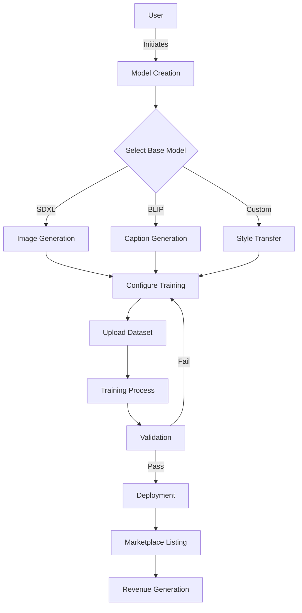
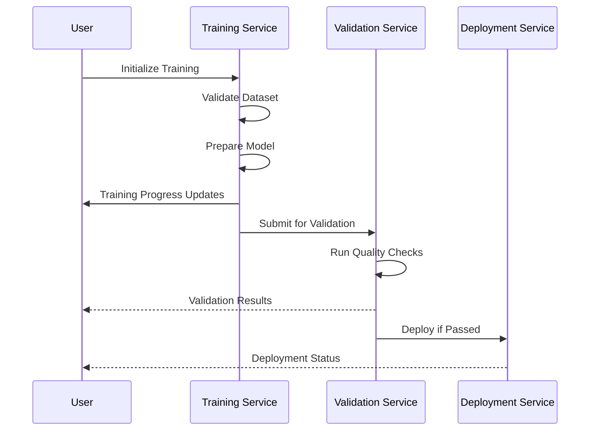
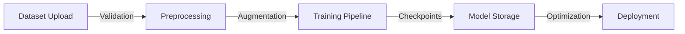
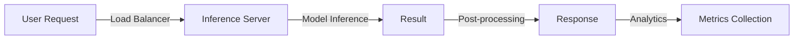

# AI Model Creation Flow & Implementation Guide

## System Architecture



## Implementation Flow

### 1. Model Creation Process

#### a. Base Model Selection
```typescript
enum ModelType {
  IMAGE_GENERATION = 'image_generation',
  CAPTION = 'caption',
  STYLE_TRANSFER = 'style_transfer'
}

interface BaseModel {
  id: string;
  type: ModelType;
  capabilities: string[];
  requirements: {
    minDataset: number;
    supportedFormats: string[];
    maxBatchSize: number;
  };
}
```

#### b. Configuration Setup
```typescript
interface ModelConfig {
  baseModel: BaseModel;
  trainingParams: {
    learningRate: number;
    epochs: number;
    batchSize: number;
    validationSplit: number;
  };
  monetization: {
    pricePerUse: number;
    subscriptionOptions?: {
      monthly: number;
      yearly: number;
    };
  };
}
```

### 2. Training Pipeline



### 3. Deployment Process

```typescript
class DeploymentManager {
  async deployModel(modelId: string) {
    // 1. Pre-deployment checks
    await this.runPreflightChecks(modelId);
    
    // 2. Model optimization
    const optimizedModel = await this.optimizeForProduction(modelId);
    
    // 3. Infrastructure setup
    const infrastructure = await this.provisionInfrastructure();
    
    // 4. Model deployment
    const endpoint = await this.deployToEndpoint(optimizedModel, infrastructure);
    
    // 5. Post-deployment validation
    await this.validateDeployment(endpoint);
    
    return endpoint;
  }
}
```

### 4. Marketplace Integration

```typescript
interface MarketplaceListing {
  modelId: string;
  creator: string;
  pricing: {
    perUse: number;
    subscription?: {
      monthly: number;
      yearly: number;
    };
  };
  metrics: {
    usageCount: number;
    rating: number;
    revenue: number;
  };
  status: 'active' | 'inactive' | 'maintenance';
}
```

## Data Flow

### 1. Training Data Flow



### 2. Inference Flow



## State Management

### 1. Training State

```typescript
interface TrainingState {
  modelId: string;
  status: 'preparing' | 'training' | 'validating' | 'completed' | 'failed';
  progress: {
    currentEpoch: number;
    totalEpochs: number;
    loss: number;
    accuracy: number;
    timeRemaining: number;
  };
  metrics: {
    trainingLoss: number[];
    validationLoss: number[];
    accuracy: number[];
  };
}
```

### 2. Deployment State

```typescript
interface DeploymentState {
  modelId: string;
  status: 'deploying' | 'active' | 'failed' | 'maintenance';
  endpoint: string;
  version: string;
  metrics: {
    uptime: number;
    requestCount: number;
    errorRate: number;
    latency: number;
  };
  scaling: {
    minInstances: number;
    maxInstances: number;
    currentInstances: number;
  };
}
```

## Error Handling

### 1. Training Errors

```typescript
class TrainingError extends Error {
  constructor(
    message: string,
    public phase: 'preparation' | 'training' | 'validation',
    public recoverable: boolean,
    public metrics?: any
  ) {
    super(message);
  }
}

// Error handling example
try {
  await trainModel(config);
} catch (error) {
  if (error instanceof TrainingError && error.recoverable) {
    await retryTraining(config);
  } else {
    await handleFatalError(error);
  }
}
```

### 2. Deployment Errors

```typescript
interface DeploymentError {
  type: 'infrastructure' | 'model' | 'validation';
  message: string;
  timestamp: number;
  context: any;
  resolution?: string;
}

// Error handling system
const deploymentErrorHandler = {
  async handle(error: DeploymentError) {
    await this.logError(error);
    await this.notifyStakeholders(error);
    
    if (this.canAutoResolve(error)) {
      await this.attemptAutoRecovery(error);
    } else {
      await this.initiateManualIntervention(error);
    }
  }
};
```

## Monitoring & Analytics

### 1. Performance Metrics

```typescript
interface ModelMetrics {
  performance: {
    inferenceTime: number;
    throughput: number;
    errorRate: number;
    resourceUtilization: {
      cpu: number;
      memory: number;
      gpu: number;
    };
  };
  business: {
    totalRequests: number;
    uniqueUsers: number;
    revenue: number;
    userSatisfaction: number;
  };
}
```

### 2. Health Checks

```typescript
class HealthMonitor {
  async checkHealth(): Promise<HealthStatus> {
    const metrics = await this.gatherMetrics();
    const status = this.analyzeMetrics(metrics);
    
    if (!status.healthy) {
      await this.triggerAlerts(status);
    }
    
    return status;
  }
}
```

## Security Implementation

### 1. Access Control

```typescript
interface AccessControl {
  modelId: string;
  permissions: {
    read: string[];
    write: string[];
    execute: string[];
    admin: string[];
  };
  rateLimit: {
    requests: number;
    window: number;
  };
}
```

### 2. Data Protection

```typescript
class DataProtection {
  async secureData(data: Buffer): Promise<SecureData> {
    const encrypted = await this.encrypt(data);
    const hash = await this.computeHash(data);
    
    return {
      data: encrypted,
      hash,
      metadata: {
        timestamp: Date.now(),
        accessControl: this.getAccessControl()
      }
    };
  }
}
```

## Best Practices & Guidelines

### 1. Model Development

- Start with small datasets and scale up
- Use cross-validation for robust evaluation
- Implement early stopping to prevent overfitting
- Monitor resource usage during training

### 2. Deployment Strategy

- Use blue-green deployment for updates
- Implement automatic rollback
- Monitor performance metrics
- Set up alerts for anomalies

### 3. Security Measures

- Validate all inputs
- Sanitize outputs
- Implement rate limiting
- Use secure communication channels

## Conclusion

This AI Model Creation flow provides:
- Structured development process
- Robust error handling
- Comprehensive monitoring
- Secure deployment pipeline

For implementation support, refer to our API documentation or join our Discord community.
