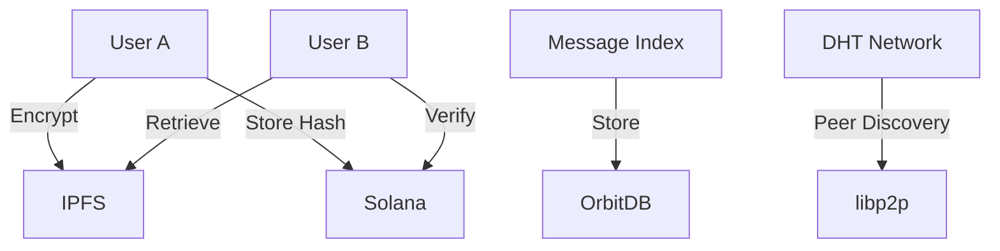
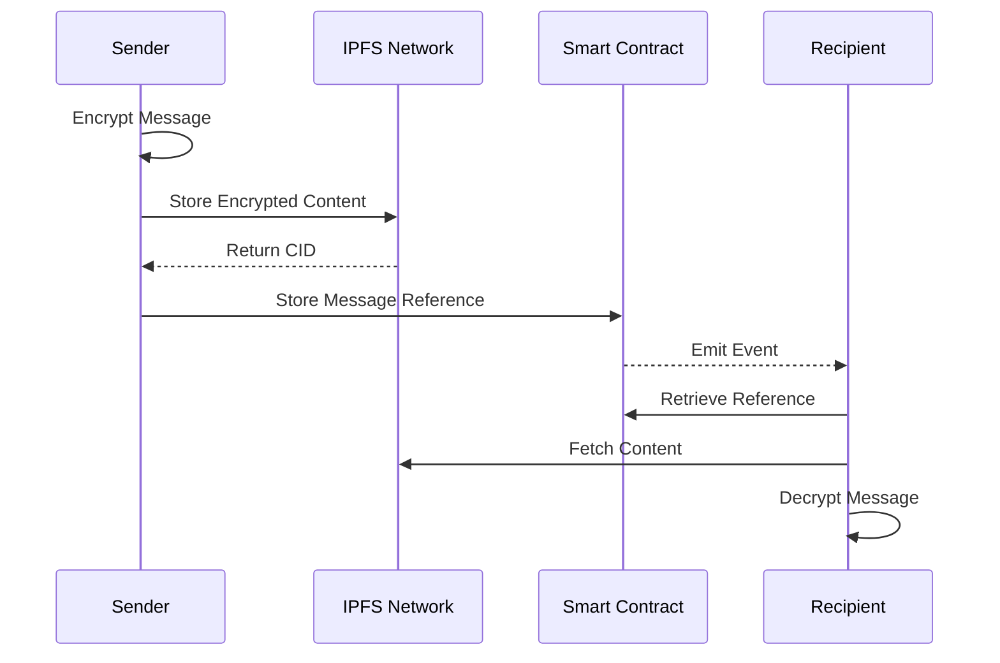

# Decentralized Messaging System Documentation

## Overview

The Chop Decentralized Messaging System (DMS) is a fully decentralized communication protocol built on Solana blockchain and IPFS, providing secure peer-to-peer messaging without central servers.

## Architecture



## Core Components

### 1. Message Storage Layer

#### IPFS Integration
```typescript
interface IPFSMessage {
  cid: string;           // Content identifier
  encryptedContent: string;
  metadata: {
    timestamp: number;
    sender: string;
    signature: string;
  };
}

class IPFSStorage {
  async storeMessage(message: EncryptedMessage): Promise<string> {
    const content = await ipfs.add(JSON.stringify(message));
    return content.cid.toString();
  }

  async retrieveMessage(cid: string): Promise<EncryptedMessage> {
    const content = await ipfs.cat(cid);
    return JSON.parse(content);
  }
}
```

### 2. Blockchain Layer

#### Solana Smart Contract
```typescript
interface MessageContract {
  // Store message reference
  storeMessage(
    recipient: PublicKey,
    messageCID: string,
    encryptedKey: string
  ): Promise<TransactionSignature>;

  // Retrieve message references
  getMessages(
    owner: PublicKey
  ): Promise<Array<{ cid: string, key: string }>>;
}
```

### 3. P2P Network Layer

#### libp2p Implementation
```typescript
class P2PNetwork {
  private node: Libp2p;

  async start() {
    this.node = await createLibp2p({
      addresses: {
        listen: ['/ip4/0.0.0.0/tcp/0']
      },
      modules: {
        transport: [TCP, WebSockets],
        connEncryption: [NOISE],
        streamMuxer: [MPLEX],
        peerDiscovery: [Bootstrap, MDNS]
      }
    });

    await this.node.start();
    this.setupMessageHandlers();
  }

  private setupMessageHandlers() {
    this.node.handle('/Chop/1.0.0', async ({ stream }) => {
      const message = await this.receiveMessage(stream);
      await this.processMessage(message);
    });
  }
}
```

### 4. Encryption Layer

#### End-to-End Encryption
```typescript
class E2EEncryption {
  async encryptMessage(
    content: string,
    recipientPubKey: PublicKey
  ): Promise<EncryptedMessage> {
    // Generate ephemeral key pair
    const ephemeralKeyPair = await this.generateKeyPair();
    
    // Derive shared secret
    const sharedSecret = await this.deriveSharedSecret(
      ephemeralKeyPair.privateKey,
      recipientPubKey
    );

    // Encrypt content
    const encryptedContent = await this.encrypt(content, sharedSecret);
    
    return {
      content: encryptedContent,
      ephemeralPubKey: ephemeralKeyPair.publicKey,
      nonce: this.generateNonce(),
      signature: await this.sign(content)
    };
  }
}
```

## Message Flow

### 1. Sending Messages



### 2. Implementation Example

```typescript
class DecentralizedMessaging {
  async sendMessage(
    recipientAddress: string,
    content: string
  ): Promise<boolean> {
    try {
      // 1. Encrypt message
      const encrypted = await this.encryption.encryptMessage(
        content,
        recipientAddress
      );

      // 2. Store on IPFS
      const cid = await this.ipfs.storeMessage(encrypted);

      // 3. Store reference on Solana
      const tx = await this.contract.storeMessage(
        recipientAddress,
        cid,
        encrypted.ephemeralPubKey
      );

      // 4. Notify peers
      await this.p2p.broadcast({
        type: 'NEW_MESSAGE',
        recipient: recipientAddress,
        cid
      });

      return true;
    } catch (error) {
      console.error('Failed to send message:', error);
      return false;
    }
  }
}
```

## Message Indexing

### 1. OrbitDB Integration

```typescript
class MessageIndex {
  private db: OrbitDB;
  private messageStore: DocumentStore;

  async initialize() {
    this.db = await OrbitDB.createInstance(ipfs);
    this.messageStore = await this.db.docstore('messages', {
      indexBy: 'id',
      replicate: true
    });

    await this.messageStore.load();
  }

  async indexMessage(message: IPFSMessage) {
    await this.messageStore.put({
      id: message.cid,
      sender: message.metadata.sender,
      timestamp: message.metadata.timestamp
    });
  }
}
```

### 2. Peer Discovery

```typescript
class PeerDiscovery {
  private peers: Map<string, PeerInfo>;

  async findPeers(topic: string): Promise<PeerInfo[]> {
    return new Promise((resolve) => {
      this.node.pubsub.subscribe(topic, (msg) => {
        const peer = this.processPeerAnnouncement(msg);
        this.peers.set(peer.id, peer);
        resolve(Array.from(this.peers.values()));
      });

      this.node.pubsub.publish(topic, this.createAnnouncement());
    });
  }
}
```

## Security Features

### 1. Message Authentication

```typescript
class MessageAuthentication {
  async verifyMessage(
    message: EncryptedMessage,
    senderPubKey: PublicKey
  ): Promise<boolean> {
    // Verify signature
    const isValidSignature = await this.verifySignature(
      message.content,
      message.signature,
      senderPubKey
    );

    // Verify timestamp
    const isValidTimestamp = this.verifyTimestamp(
      message.metadata.timestamp
    );

    return isValidSignature && isValidTimestamp;
  }
}
```

### 2. Forward Secrecy

```typescript
class ForwardSecrecy {
  private readonly MESSAGE_TTL = 24 * 60 * 60 * 1000; // 24 hours

  async rotateKeys(): Promise<void> {
    const newKeyPair = await this.generateKeyPair();
    await this.updatePublicKey(newKeyPair.publicKey);
    await this.securelyStorePrivateKey(newKeyPair.privateKey);
  }

  async cleanupOldMessages(): Promise<void> {
    const cutoff = Date.now() - this.MESSAGE_TTL;
    await this.removeMessagesOlderThan(cutoff);
  }
}
```

## Performance Optimization

### 1. Message Caching

```typescript
class MessageCache {
  private cache: LRUCache<string, IPFSMessage>;

  constructor() {
    this.cache = new LRUCache({
      max: 1000,
      maxAge: 1000 * 60 * 60 // 1 hour
    });
  }

  async getMessage(cid: string): Promise<IPFSMessage> {
    if (this.cache.has(cid)) {
      return this.cache.get(cid)!;
    }

    const message = await this.ipfs.retrieveMessage(cid);
    this.cache.set(cid, message);
    return message;
  }
}
```

### 2. Network Optimization

```typescript
class NetworkOptimizer {
  private readonly MAX_BATCH_SIZE = 50;
  private messageQueue: Message[] = [];

  async queueMessage(message: Message): Promise<void> {
    this.messageQueue.push(message);
    
    if (this.messageQueue.length >= this.MAX_BATCH_SIZE) {
      await this.processBatch();
    }
  }

  private async processBatch(): Promise<void> {
    const batch = this.messageQueue.splice(0, this.MAX_BATCH_SIZE);
    await this.ipfs.addAll(batch);
  }
}
```

## Error Handling

```typescript
class MessageError extends Error {
  constructor(
    message: string,
    public code: string,
    public recoverable: boolean,
    public context?: any
  ) {
    super(message);
    this.name = 'MessageError';
  }
}

class ErrorHandler {
  async handle(error: MessageError): Promise<void> {
    console.error(`Message error: ${error.code}`, error);

    if (error.recoverable) {
      await this.attemptRecovery(error);
    } else {
      await this.notifyUser(error);
    }

    await this.logError(error);
  }
}
```

## Best Practices

### 1. Message Handling
- Validate all messages before processing
- Implement message acknowledgment
- Handle network partitions
- Maintain message ordering

### 2. Security
- Regular key rotation
- Message expiration
- Peer verification
- Rate limiting

### 3. Network
- Efficient peer discovery
- Connection pooling
- Bandwidth management
- DHT optimization

## Future Improvements

### 1. Planned Features
- Group messaging
- File sharing
- Message search
- Offline messaging

### 2. Scalability
- Sharding
- Message pruning
- Network optimization
- Performance enhancements

## Support & Resources

### 1. Documentation
- API reference
- Integration guides
- Security best practices
- Troubleshooting guide

### 2. Community
- Discord channel
- Developer forum
- Bug reports
- Feature requests

## Conclusion

The Decentralized Messaging System provides:
- Complete decentralization
- End-to-end encryption
- Forward secrecy
- Scalable architecture

For technical support or feature requests, please refer to our GitHub repository or join our Discord community.
