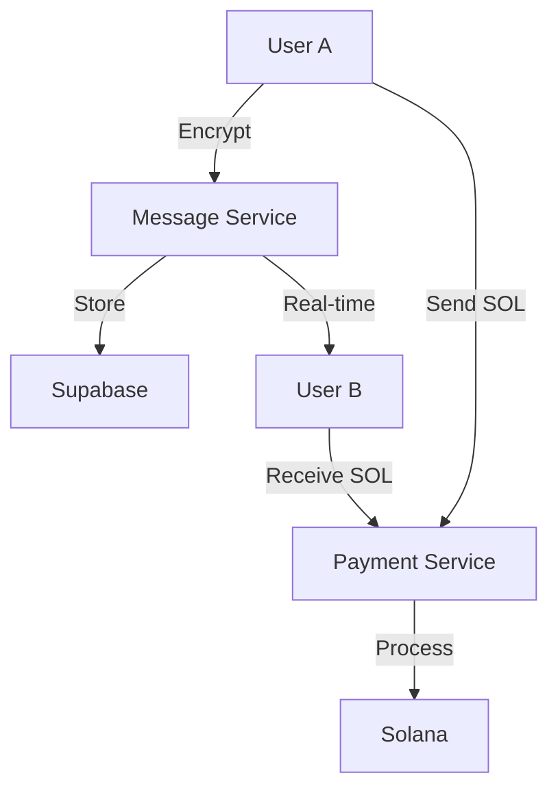

# Chop Messaging System Documentation

## Overview

The Chop Messaging System provides secure, real-time P2P communication with integrated payments. The system combines blockchain security with traditional messaging features to create a comprehensive communication platform.

## System Architecture



## Core Features

### 1. P2P Encrypted Messaging

#### Encryption Implementation
```typescript
interface EncryptedMessage {
  id: string;
  sender: string;
  receiver: string;
  content: string;  // Encrypted
  timestamp: number;
  signature: string;
}

class MessageEncryption {
  async encryptMessage(
    content: string,
    recipientPublicKey: string
  ): Promise<string> {
    // Encryption implementation
    return encryptedContent;
  }

  async decryptMessage(
    encryptedContent: string,
    privateKey: string
  ): Promise<string> {
    // Decryption implementation
    return decryptedContent;
  }
}
```

#### Security Features
- End-to-end encryption
- Message signing
- Forward secrecy
- Secure key exchange

### 2. Real-time Updates

#### WebSocket Implementation
```typescript
class MessageSocket {
  private supabase: SupabaseClient;
  
  constructor() {
    this.supabase = createClient(SUPABASE_URL, SUPABASE_KEY);
  }

  subscribe(userId: string) {
    return this.supabase
      .channel('messages')
      .on('INSERT', (payload) => {
        this.handleNewMessage(payload);
      })
      .subscribe();
  }
}
```

#### Features
- Instant message delivery
- Typing indicators
- Online status
- Read receipts

### 3. Message Persistence

#### Database Schema
```sql
CREATE TABLE messages (
  id UUID PRIMARY KEY DEFAULT uuid_generate_v4(),
  sender_address TEXT NOT NULL,
  receiver_address TEXT NOT NULL,
  content TEXT NOT NULL,
  created_at TIMESTAMP WITH TIME ZONE DEFAULT timezone('utc'::text, now()) NOT NULL,
  read BOOLEAN DEFAULT FALSE NOT NULL
);

-- Indexes
CREATE INDEX messages_sender_address_idx ON messages(sender_address);
CREATE INDEX messages_receiver_address_idx ON messages(receiver_address);
CREATE INDEX messages_created_at_idx ON messages(created_at DESC);
```

#### Storage Features
- Message history
- Search functionality
- Message backup
- Data encryption

### 4. Media Sharing

#### Media Handling
```typescript
interface MediaMessage extends Message {
  mediaType: 'image' | 'video' | 'audio' | 'file';
  mediaUrl: string;
  thumbnailUrl?: string;
  metadata: {
    size: number;
    mimeType: string;
    duration?: number;
    dimensions?: {
      width: number;
      height: number;
    };
  };
}

class MediaHandler {
  async uploadMedia(file: File): Promise<MediaMessage> {
    // Compress and upload to IPFS
    const compressed = await this.compressMedia(file);
    const ipfsHash = await this.uploadToIPFS(compressed);
    
    return {
      mediaType: this.getMediaType(file),
      mediaUrl: `ipfs://${ipfsHash}`,
      metadata: await this.extractMetadata(file)
    };
  }
}
```

#### Features
- Image compression
- Video thumbnails
- File type validation
- Progress tracking

### 5. P2P Payments

#### Payment Integration
```typescript
interface PaymentMessage {
  amount: number;
  token: 'SOL' | 'USDC';
  status: 'pending' | 'completed' | 'failed';
  transactionHash?: string;
}

class PaymentService {
  async sendPayment(
    recipient: string,
    amount: number,
    token: 'SOL' | 'USDC'
  ): Promise<PaymentMessage> {
    const transaction = await this.createTransaction(recipient, amount, token);
    const signature = await this.signAndSend(transaction);
    
    return {
      amount,
      token,
      status: 'completed',
      transactionHash: signature
    };
  }
}
```

#### Features
- Multiple token support
- Transaction history
- Payment requests
- Auto-confirmation

## Implementation Example

### 1. Sending Messages

```typescript
const messaging = {
  async sendMessage(
    recipientAddress: string,
    content: string
  ): Promise<Message | null> {
    if (!publicKey) {
      toast.error('Please connect your wallet first');
      return null;
    }

    try {
      setIsLoading(true);
      const message = {
        id: uuidv4(),
        sender_address: publicKey.toString(),
        receiver_address: recipientAddress,
        content,
        created_at: new Date().toISOString(),
        read: false
      };

      const { error } = await supabase
        .from('messages')
        .insert(message);

      if (error) throw error;

      return message;
    } catch (error) {
      console.error('Error sending message:', error);
      toast.error('Failed to send message');
      return null;
    } finally {
      setIsLoading(false);
    }
  }
};
```

### 2. Real-time Updates

```typescript
const useMessaging = () => {
  useEffect(() => {
    if (!publicKey) return;

    const subscription = supabase
      .channel('messages')
      .on(
        'postgres_changes',
        {
          event: 'INSERT',
          schema: 'public',
          table: 'messages',
          filter: `receiver_address=eq.${publicKey.toString()}`
        },
        (payload) => {
          const newMessage = payload.new as Message;
          setMessages(prev => [...prev, newMessage]);
          toast.success('New message received!');
        }
      )
      .subscribe();

    return () => {
      subscription.unsubscribe();
    };
  }, [publicKey]);
};
```

### 3. Payment Integration

```typescript
const messagePayments = {
  async sendPaymentMessage(
    recipient: string,
    amount: number,
    message: string
  ) {
    // Create and send transaction
    const transaction = await createTransaction(recipient, amount);
    const signature = await sendTransaction(transaction);
    
    // Send message with payment details
    await sendMessage(recipient, {
      type: 'payment',
      amount,
      signature,
      message
    });
  }
};
```

## Security Considerations

### 1. Message Security
- End-to-end encryption
- Message signing
- Secure key storage
- Anti-tampering measures

### 2. Payment Security
- Transaction verification
- Amount validation
- Double-spend prevention
- Error handling

### 3. Data Protection
- Message encryption
- Secure storage
- Access control
- Data retention

## Performance Optimization

### 1. Message Delivery
- Message queuing
- Batch processing
- Connection pooling
- Cache management

### 2. Media Handling
- Image compression
- Lazy loading
- Progressive loading
- Cache strategy

## Error Handling

```typescript
class MessageError extends Error {
  constructor(
    message: string,
    public code: string,
    public recoverable: boolean
  ) {
    super(message);
    this.name = 'MessageError';
  }
}

const errorHandler = {
  async handle(error: MessageError) {
    console.error('Message error:', error);
    
    if (error.recoverable) {
      await this.retryOperation();
    } else {
      toast.error(error.message);
    }
  }
};
```

## Best Practices

### 1. Message Handling
- Validate all inputs
- Handle offline scenarios
- Implement retry logic
- Maintain message order

### 2. Payment Integration
- Verify transactions
- Handle timeouts
- Implement fallbacks
- Track payment status

### 3. Media Sharing
- Validate file types
- Limit file sizes
- Compress media
- Handle upload failures

## Future Improvements

### 1. Planned Features
- Group messaging
- Message reactions
- Voice messages
- Payment streaming

### 2. Scalability Plans
- Sharding strategy
- Load balancing
- Message archiving
- Performance optimization

## Support & Resources

### 1. Documentation
- API reference
- Integration guides
- Best practices
- Troubleshooting

### 2. Community
- Discord support
- Feature requests
- Bug reports
- Developer forum

## Conclusion

The Chop Messaging System provides:
- Secure communication
- Integrated payments
- Real-time updates
- Media sharing capabilities

For technical support or feature requests, please refer to our GitHub repository or join our Discord community.
