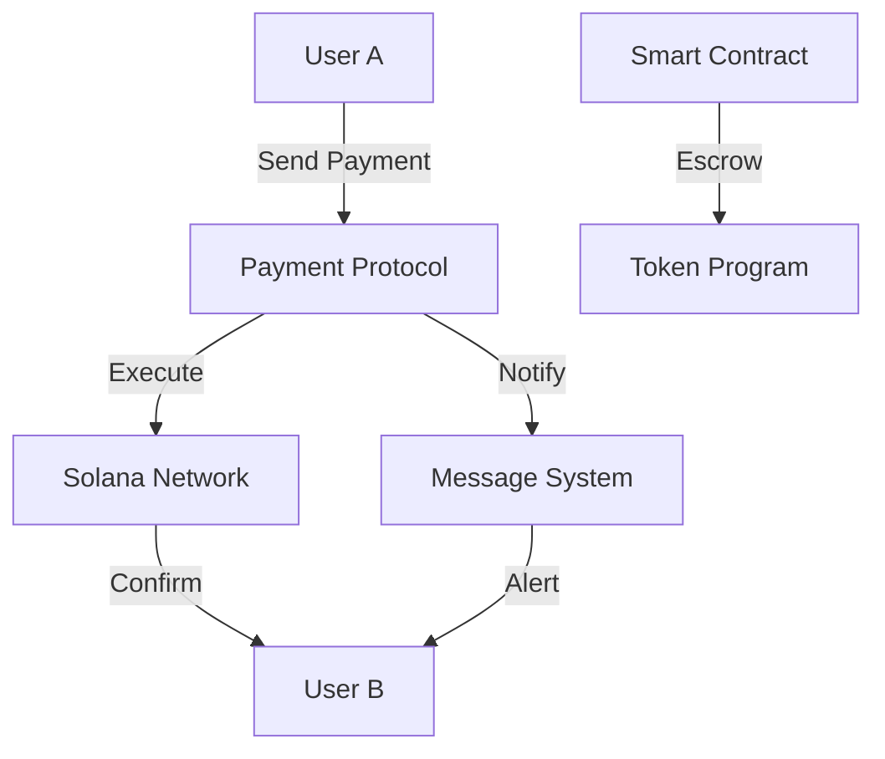
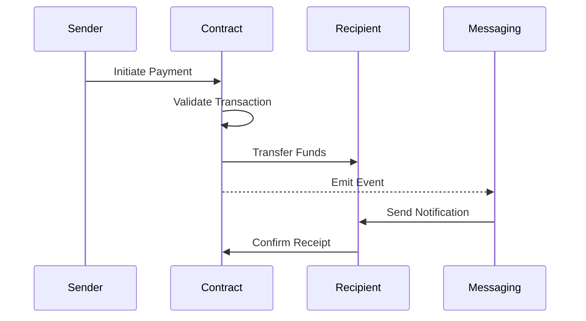
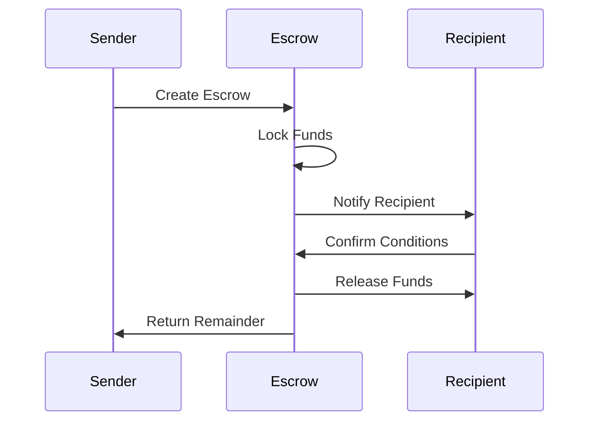

# P2P Payment System Documentation

## Overview

The Chop P2P Payment System is a decentralized payment protocol integrated with the messaging system, enabling secure peer-to-peer transactions on the Solana blockchain.

## Architecture



## Core Components

### 1. Payment Protocol

```typescript
interface PaymentTransaction {
  sender: PublicKey;
  recipient: PublicKey;
  amount: number;
  token: 'SOL' | 'USDC' | string;
  reference: string;
  timestamp: number;
}

class PaymentProtocol {
  async sendPayment(
    recipient: PublicKey,
    amount: number,
    token: string = 'SOL'
  ): Promise<TransactionSignature> {
    // Create and send transaction
    const tx = await this.createTransaction(recipient, amount, token);
    return await this.signAndSendTransaction(tx);
  }

  async createTransaction(
    recipient: PublicKey,
    amount: number,
    token: string
  ): Promise<Transaction> {
    // Implementation
  }
}
```

### 2. Smart Contract Integration

```typescript
interface PaymentContract {
  // Direct transfer
  transfer(
    recipient: PublicKey,
    amount: number
  ): Promise<TransactionSignature>;

  // Escrow payment
  createEscrow(
    recipient: PublicKey,
    amount: number,
    conditions: EscrowConditions
  ): Promise<string>;

  // Release escrow
  releaseEscrow(
    escrowId: string
  ): Promise<TransactionSignature>;
}
```

### 3. Message Integration

```typescript
interface PaymentMessage {
  type: 'payment';
  transactionSignature: string;
  amount: number;
  token: string;
  status: 'pending' | 'completed' | 'failed';
  message?: string;
}

class PaymentMessaging {
  async sendPaymentMessage(
    recipient: PublicKey,
    payment: PaymentMessage
  ): Promise<void> {
    await this.messaging.sendMessage(recipient, {
      type: 'payment',
      ...payment
    });
  }
}
```

## Payment Flow

### 1. Direct Payment



### 2. Escrow Payment



## Implementation Example

### 1. Send Payment

```typescript
class P2PPayment {
  async sendPayment(
    recipientAddress: string,
    amount: number,
    options?: PaymentOptions
  ): Promise<PaymentResult> {
    try {
      // 1. Create transaction
      const transaction = await this.createTransaction(
        recipientAddress,
        amount,
        options
      );

      // 2. Sign and send
      const signature = await this.wallet.signAndSendTransaction(
        transaction
      );

      // 3. Send payment message
      await this.messaging.sendPaymentMessage(
        recipientAddress,
        {
          type: 'payment',
          amount,
          signature,
          status: 'completed'
        }
      );

      return {
        success: true,
        signature,
        timestamp: Date.now()
      };
    } catch (error) {
      console.error('Payment failed:', error);
      throw new PaymentError(error.message);
    }
  }
}
```

### 2. Handle Payment

```typescript
class PaymentHandler {
  async handleIncomingPayment(
    payment: PaymentMessage
  ): Promise<void> {
    // 1. Verify transaction
    const isValid = await this.verifyTransaction(
      payment.transactionSignature
    );

    if (!isValid) {
      throw new PaymentError('Invalid transaction');
    }

    // 2. Update balance
    await this.updateBalance(payment.amount);

    // 3. Send confirmation
    await this.sendConfirmation(payment);
  }
}
```

## Security Features

### 1. Transaction Verification

```typescript
class TransactionVerification {
  async verifyTransaction(
    signature: string
  ): Promise<boolean> {
    // Get transaction details
    const tx = await connection.getTransaction(signature);
    
    // Verify amount and recipient
    return this.validateTransaction(tx);
  }

  private validateTransaction(
    tx: TransactionResponse
  ): boolean {
    // Implementation
    return true;
  }
}
```

### 2. Escrow System

```typescript
class EscrowSystem {
  async createEscrow(
    amount: number,
    conditions: EscrowConditions
  ): Promise<string> {
    // Create escrow account
    const escrowAccount = await this.createEscrowAccount();
    
    // Lock funds
    await this.lockFunds(escrowAccount, amount);
    
    // Set conditions
    await this.setConditions(escrowAccount, conditions);
    
    return escrowAccount.publicKey.toString();
  }
}
```

## Error Handling

```typescript
class PaymentError extends Error {
  constructor(
    message: string,
    public code: string,
    public recoverable: boolean
  ) {
    super(message);
    this.name = 'PaymentError';
  }
}

class PaymentErrorHandler {
  async handle(error: PaymentError): Promise<void> {
    // Log error
    console.error('Payment error:', error);

    // Attempt recovery if possible
    if (error.recoverable) {
      await this.attemptRecovery(error);
    }

    // Notify user
    await this.notifyUser(error);
  }
}
```

## Performance Optimization

### 1. Transaction Batching

```typescript
class TransactionBatcher {
  private queue: Transaction[] = [];
  private readonly BATCH_SIZE = 10;

  async addToQueue(tx: Transaction): Promise<void> {
    this.queue.push(tx);
    
    if (this.queue.length >= this.BATCH_SIZE) {
      await this.processBatch();
    }
  }

  private async processBatch(): Promise<void> {
    const batch = this.queue.splice(0, this.BATCH_SIZE);
    await this.sendBatch(batch);
  }
}
```

### 2. Cache Management

```typescript
class PaymentCache {
  private cache: LRUCache<string, PaymentTransaction>;

  constructor() {
    this.cache = new LRUCache({
      max: 1000,
      maxAge: 1000 * 60 * 60 // 1 hour
    });
  }

  async getTransaction(
    signature: string
  ): Promise<PaymentTransaction | null> {
    return this.cache.get(signature) || null;
  }
}
```

## Best Practices

### 1. Transaction Handling
- Validate all inputs
- Verify signatures
- Check balances
- Handle timeouts

### 2. Security
- Rate limiting
- Amount validation
- Address verification
- Error handling

### 3. User Experience
- Clear notifications
- Transaction history
- Status updates
- Error messages

## Future Improvements

### 1. Planned Features
- Multi-signature transactions
- Payment streaming
- Recurring payments
- Cross-chain support

### 2. Scalability
- Transaction batching
- State channels
- Layer 2 solutions
- Performance optimization

## Support & Resources

### 1. Documentation
- API reference
- Integration guides
- Security best practices
- Troubleshooting guide

### 2. Community
- Discord support
- Developer forum
- Bug reports
- Feature requests

## Conclusion

The P2P Payment System provides:
- Secure transactions
- Messaging integration
- Escrow support
- Real-time notifications

For technical support or feature requests, please refer to our GitHub repository or join our Discord community.
